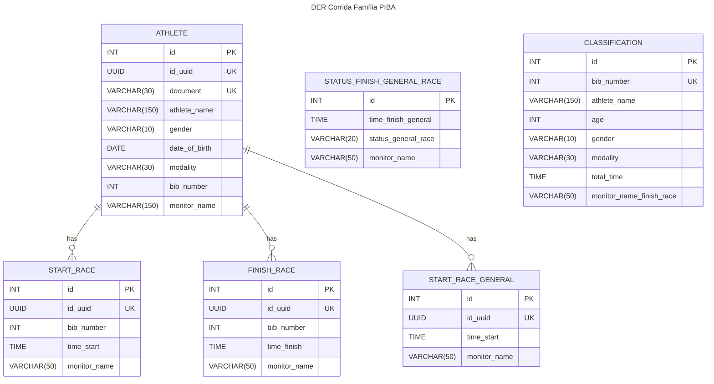

```mermaid
---
    title: DER Corrida Família PIBA
---

erDiagram
    
    ATHLETE {
        INT id PK
        UUID id_uuid UK
        VARCHAR(30) document UK
        VARCHAR(150) athlete_name
        VARCHAR(10) gender
        DATE date_of_birth
        VARCHAR(30) modality
        INT bib_number
        VARCHAR(150) monitor_name
    }

    START_RACE {
        INT id PK
        UUID id_uuid UK
        INT bib_number
        TIME time_start
        VARCHAR(50) monitor_name
    }

    FINISH_RACE {
        INT id PK
        UUID id_uuid UK
        INT bib_number
        TIME time_finish
        VARCHAR(50) monitor_name
    }

    START_RACE_GENERAL {
        INT id PK
        UUID id_uuid UK
        TIME time_start
        VARCHAR(50) monitor_name
    }

    STATUS_FINISH_GENERAL_RACE {
        INT id PK
        TIME time_finish_general
        VARCHAR(20) status_general_race
        VARCHAR(50) monitor_name
    }

    CLASSIFICATION {
        INT id PK
        INT bib_number UK
        VARCHAR(150) athlete_name
        INT age
        VARCHAR(10) gender
        VARCHAR(30) modality
        TIME total_time
        VARCHAR(50) monitor_name_finish_race
    }

    ATHLETE ||--o{ START_RACE         : "has"
    ATHLETE ||--o{ FINISH_RACE        : "has"
    ATHLETE ||--o{ START_RACE_GENERAL : "has"

```