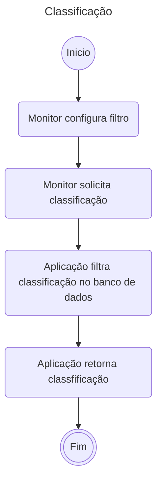

```mermaid
---
    title: Classificação
---
flowchart TD
    start1((Inicio)) --> task0(Monitor configura filtro) --> task1(Monitor solicita classificação) --> task2(Aplicação filtra classificação no banco de dados) --> task3(Aplicação retorna classfificação) --> end1(((Fim)))


```

