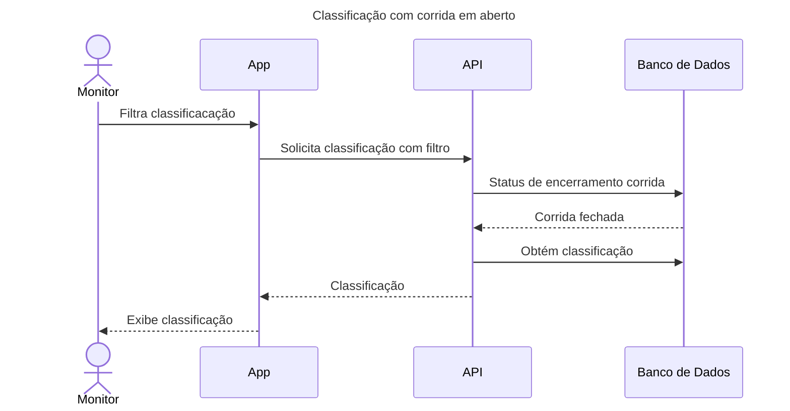

```mermaid
---
    title: Classificação com corrida em aberto
---
sequenceDiagram
    actor monitor as Monitor
    participant app as App
    participant api as API
    participant db as Banco de Dados
    monitor->>app: Filtra classificacação
    app->>api: Solicita classificação com filtro
    api->>db: Status de encerramento corrida
    db-->>api: Corrida fechada
    api->>db: Obtém classificação
    api-->>app: Classificação
    app-->>monitor: Exibe classificação
```

