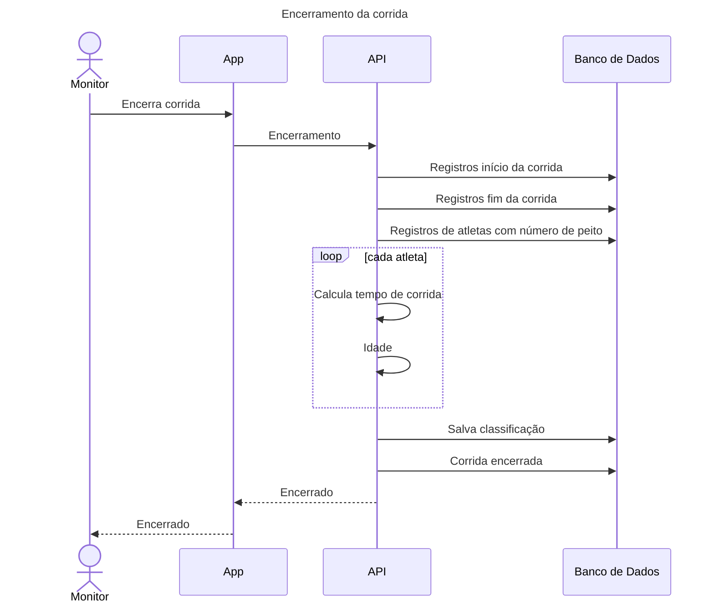

```mermaid
---
    title: Encerramento da corrida
---
sequenceDiagram
    actor monitor as Monitor
    participant app as App
    participant api as API
    participant db as Banco de Dados
    monitor->>app: Encerra corrida
    app->>api: Encerramento
    api->>db: Registros início da corrida
    api->>db: Registros fim da corrida
    api->>db: Registros de atletas com número de peito
    loop cada atleta
        api->>api: Calcula tempo de corrida
        api->>api: Idade
    end
    api->>db: Salva classificação
    api->>db: Corrida encerrada
    api-->>app: Encerrado
    app-->>monitor: Encerrado
```

