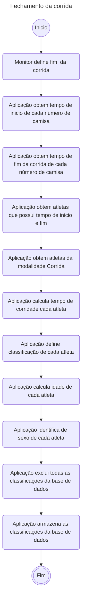

```mermaid
---
    title: Fechamento da corrida
---
flowchart TD
    start1((Inicio)) --> task0(Monitor define fim  da corrida) --> task1(Aplicação obtem tempo de inicio de cada número de camisa) --> task2(Aplicação obtem tempo de fim da corrida de cada número de camisa) --> task3(Aplicação obtem atletas que possui tempo de inicio e fim) --> task4(Aplicação obtem atletas da modalidade Corrida) --> task5(Aplicação calcula tempo de corridade cada atleta) --> task6(Aplicação define classificação de cada atleta) --> task7(Aplicação calcula idade de cada atleta) --> task8(Aplicação identifica de sexo de cada atleta) --> task9(Aplicação exclui todas as classificações da base de dados) --> task10(Aplicação armazena as classificações da base de dados) --> end1(((Fim)))


```

